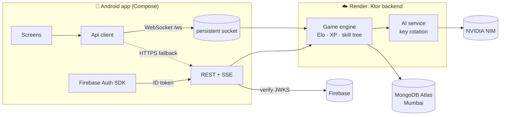

<div align="center">

# ⚔️ Masteria

### Learn. Quest. Level Up.

An adaptive learning RPG for Android. A short diagnostic finds your weakest topic, the app builds
bite-sized quests around it, and questions adapt to you as you play. You earn XP for **mastery gained**,
not for time spent, and boss battles unlock the next region of your skill map.

[](https://github.com/Sriram-ake/masteria/actions/workflows/ci.yml)
[](https://github.com/Sriram-ake/masteria/actions/workflows/release.yml)
[](https://github.com/Sriram-ake/masteria/releases/latest)


*Team Triple Threats · iQOO Hackathon 2026 · Smart Education*

</div>

---

## ✨ Features

| | |
|---|---|
| 🎯 **Adaptive quests** | An Elo-based learner model picks every question to land near a 78 % chance of success, gets harder when you're cruising and easier (hint first) when you're stuck. |
| 🗺️ **Skill-tree map** | Topics light up with your live mastery. Beat a topic's **boss** (4/5 at ≥ 80 % mastery) to unlock what comes next. |
| 🧠 **AI mentor** | A streaming chat tutor that knows your real mastery and guides you to answers instead of giving them away. |
| 📸 **Scan-to-Quest** | Photograph a textbook page. On-device OCR plus AI turn it into a validated 5-question quest. |
| 🔍 **Mistake analysis** | After a wrong answer, a short diagnosis of the likely misconception. |
| 🏆 **RPG progression** | XP, levels, coins, streaks, badges and spaced-repetition reviews. |
| 🌍 **Three worlds, one engine** | School maths (Class 9), SSC CGL Quant, and Java OOP: 180 hand-verified questions. |
| 🔐 **Accounts** | Firebase sign-in (email/password or Google), or play as a guest and upgrade later without losing progress. |
| ⚡ **Real-time** | One WebSocket carries every call and streams mentor replies, with automatic HTTP fallback. |

Every AI-generated question is independently re-solved by a second model (and, for linear equations,
by an exact Kotlin solver) before a learner ever sees it.

## 🏗️ Architecture



- **Answers never wait on AI.** `/quests/{id}/answer` is pure learner-model maths (no AI calls). AI question generation runs in the background.
- **Resilient AI.** Several NVIDIA NIM keys rotate automatically: an invalid key is set aside and a rate-limited key rests. If no model or key is available, the app falls back to vetted content.

## 📁 Repository layout

```
├── android/            Jetpack Compose app (Kotlin)
│   └── app/src/main/java/com/triplethreats/masteria/
│       ├── data/       Api, WebSocket client, Firebase auth, session
│       └── ui/         screens, components, theme
├── backend/            Ktor server (Kotlin, JDK 17)
│   └── src/main/kotlin/com/triplethreats/masteria/
│       ├── ai/         NIM client, key rotation, question pipeline
│       ├── auth/       Firebase ID-token verification
│       ├── db/         MongoDB + JSON-file stores
│       ├── learner/    Elo, adaptivity, progression, skill tree
│       ├── routes/     REST, WebSocket, DTOs
│       └── service/    game engine
├── content/            tracks + vetted question bank (bundled into the server)
├── docs/API.md         API contract shared by app and server
├── render.yaml         Render blueprint
└── .github/workflows/  CI + signed APK releases
```

## 🚀 Getting started

### Prerequisites
JDK 17 · Android Studio (SDK 37) · a MongoDB Atlas cluster (optional locally) · a Firebase project · NVIDIA NIM API key(s)

### 1. Backend

```bash
cd backend
cp .env.example .env        # fill in the values below
./gradlew run               # http://localhost:8080
./gradlew test              # full test suite
```

| Variable | Purpose |
|---|---|
| `MONGODB_URI` | MongoDB Atlas connection string. Without it, a local JSON file is used. |
| `FIREBASE_PROJECT_ID` | Enables Firebase sign-in (`POST /auth/firebase`). |
| `NVIDIA_API_KEYS` | One or more NIM keys, comma-separated, rotated on failure. |
| `JWT_SECRET` | Signs session tokens; keep it the same across deploys. |
| `KEEP_ALIVE` | `true` on Render: the server pings itself every 5 min. |

See [`backend/.env.example`](backend/.env.example) for everything else.

### 2. Android app

1. Put your Firebase `google-services.json` in `android/app/` (it's git-ignored).
2. Point the app at your server in `android/local.properties`:
   ```properties
   BACKEND_URL=https://<your-app>.onrender.com
   ```
3. Build and run:
   ```bash
   cd android
   ./gradlew installDebug
   ```
   On an emulator with a local backend, the default `http://10.0.2.2:8080` just works.
   The server address can also be changed at runtime in **Settings**.

## ☁️ Deployment

**Backend → Render.** In the Render dashboard, choose *New → Blueprint* and select this repo. It reads [`render.yaml`](render.yaml)
(Docker, Singapore region, closest to the Mumbai Atlas cluster). Set `MONGODB_URI`, `FIREBASE_PROJECT_ID` and
`NVIDIA_API_KEYS` in the dashboard. Pushes to `main` deploy automatically once CI passes.
In MongoDB Atlas → Network Access, allow `0.0.0.0/0` so Render can connect.

**Keep-alive.** The free plan sleeps after 15 min without traffic. Point an uptime monitor
(cron-job.org, UptimeRobot) at `GET https://<your-app>.onrender.com/health` every 5 minutes; `HEAD` works too,
and the endpoint touches no database or AI.

**Android → GitHub Releases.** Push a version tag and CI builds, signs, verifies and publishes the APK:

```bash
git tag v1.0.0 && git push origin v1.0.0
```

The release workflow needs these repository **secrets**: `ANDROID_KEYSTORE_BASE64`, `ANDROID_KEYSTORE_PASSWORD`,
`ANDROID_KEY_ALIAS`, `ANDROID_KEY_PASSWORD`, `GOOGLE_SERVICES_JSON`. It also needs the **variable** `BACKEND_URL`.

## 🔌 API

REST + Server-Sent Events + WebSocket, fully specified in [`docs/API.md`](docs/API.md).

| | |
|---|---|
| `GET /health`, `GET /ping` | liveness / keep-alive |
| `POST /auth/firebase` | Firebase ID token → Masteria session |
| `POST /quests/start` · `/answer` · `/complete` | the quest loop |
| `POST /ai/mentor` | streaming mentor (SSE) |
| `GET /ws` | one socket for everything, plus live "changed" pushes |

## 🛡️ Security

- No secrets live in the repo: `.env`, `google-services.json`, keystores and `local.properties` are all git-ignored.
- The NVIDIA keys never ship in the APK; every AI call goes through the backend.
- Firebase tokens are verified against Google's public keys. Sign-in routes are rate-limited per IP.
- `DELETE /auth/me` erases an account and all of its data (DPDP).

## 👥 Team

**Triple Threats**: built for the iQOO Hackathon 2026 (theme: Smart Education).
